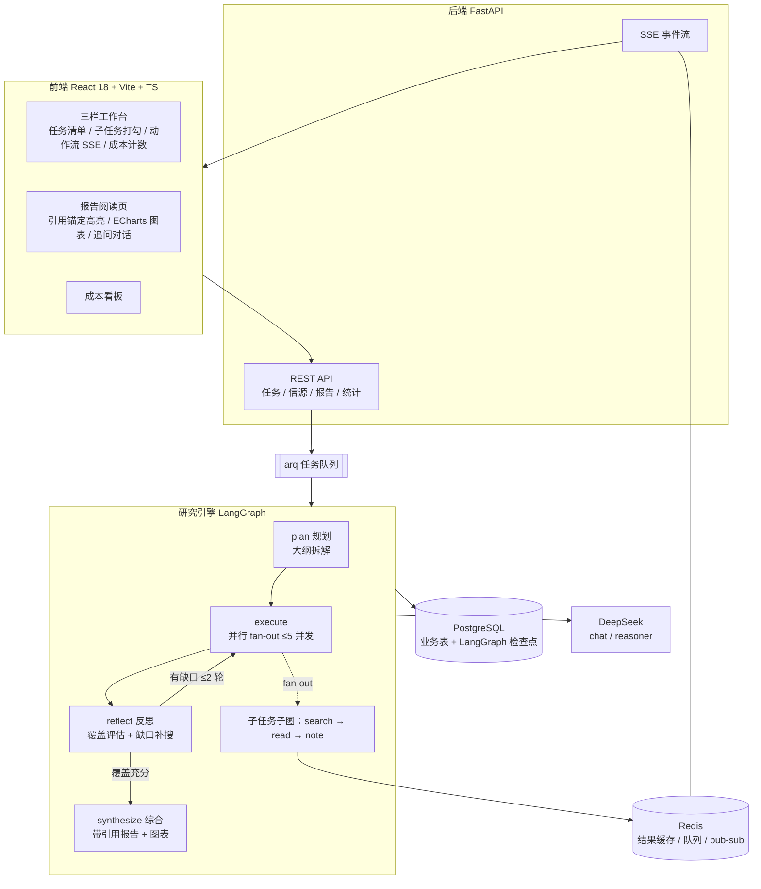
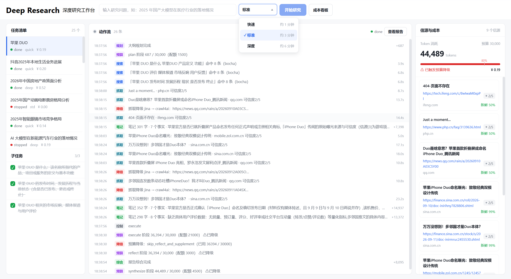
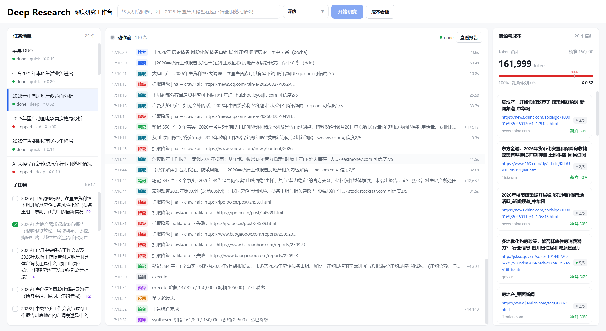
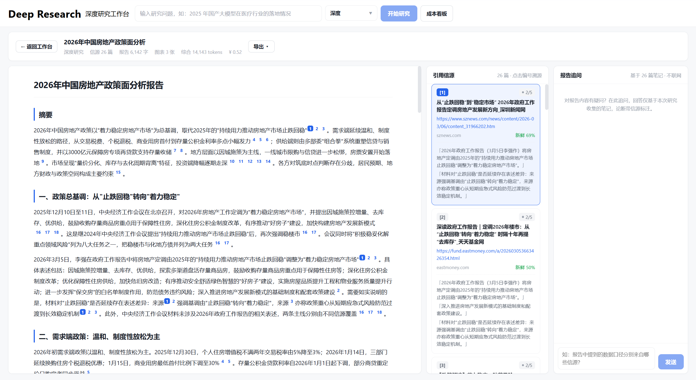
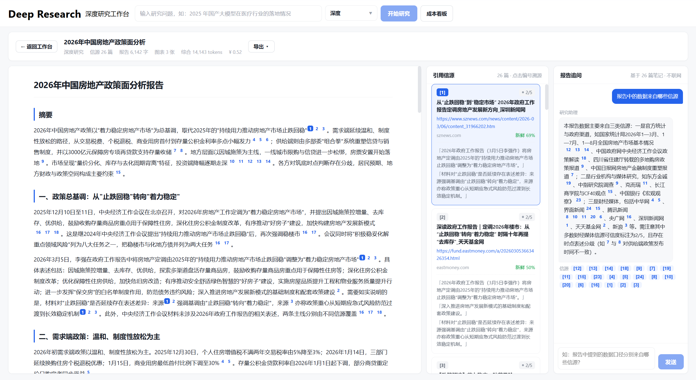
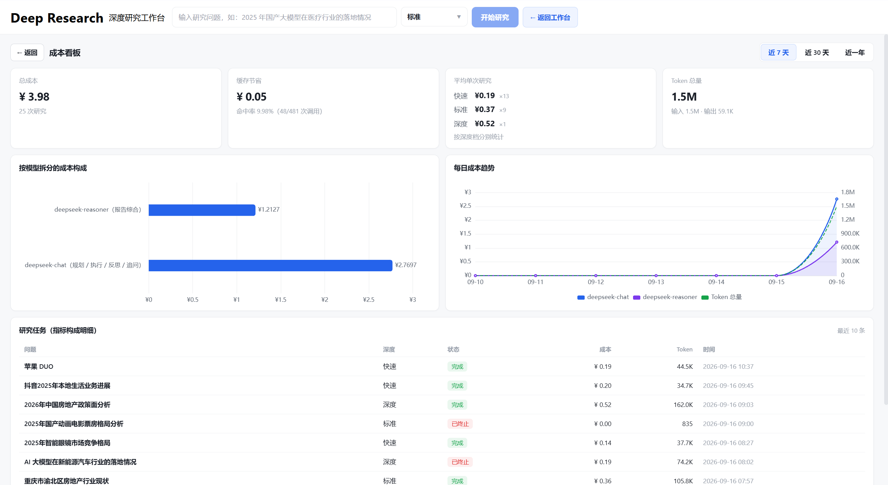
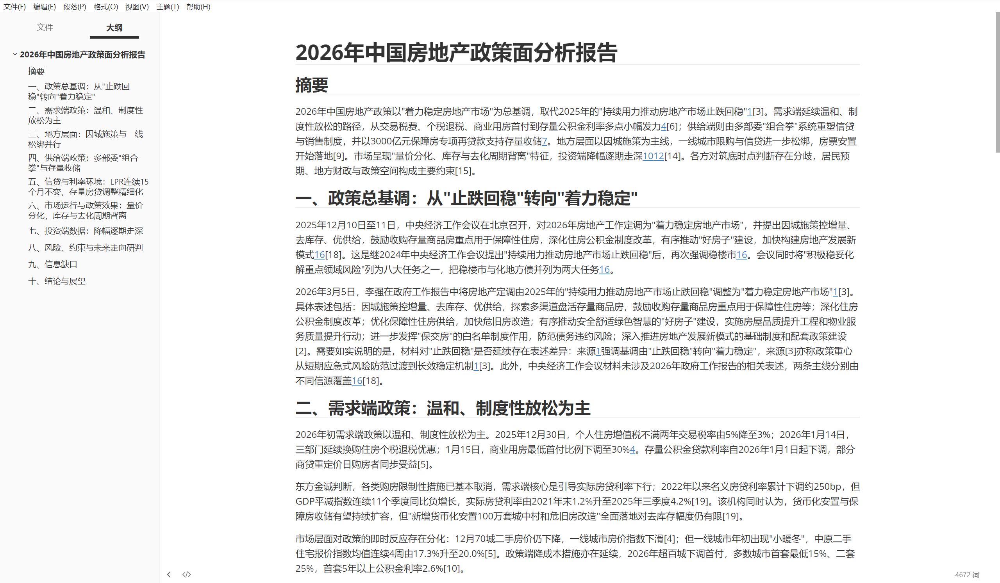

# Deep Research Platform

> 自主研究 Agent 平台：给定一个研究问题，系统自主完成 **规划 → 检索 → 阅读 → 反思 → 综合** 的完整研究闭环，产出带引用锚点、数据图表与信源可信度标注的研究报告。

用户提交问题后无需干预：系统自动拆解子问题、并行检索阅读网页、压缩结构化笔记、反思覆盖缺口并补搜、最终综合成一份可溯源的报告。全过程动作流实时推送（SSE），支持暂停/恢复/终止、追加研究指示、token 预算控制与断点续跑。

## 核心特性

**研究引擎**
- **主图四阶段闭环**：plan（大纲拆解）→ execute（并行 fan-out）→ reflect（覆盖度反思 + 缺口补搜，≤2 轮）→ synthesize（报告综合），基于 LangGraph 状态图实现
- **深度档位**：quick / std / deep 三档，分别对应 3 / 5 / 8 个子任务与 30k / 80k / 150k token 预算
- **「搜读记」子图**：每个子任务走 search → read → note 流水线，URL 与正文哈希双重去重
- **三级降级读页**：Jina Reader → crawl4ai（本地 Chromium 渲染，兜住 JS 动态页）→ trafilatura，任一级失败自动降级，降级轨迹落事件流
- **搜索双通道**：博查 API（指数退避重试）→ DuckDuckGo 兜底，Redis 24h 结果缓存
- **结构化笔记**：instructor 约束 schema 输出（摘要 + 事实 + 缺口），数字锚点提示词保证引用可溯源

**报告质量**
- **引用锚点校验**：报告中的 `[N]` 编号必须来自信源清单，编造引用触发 schema 重试；生成后按首次出现顺序重编号
- **信源画像**：预置域名可信度分级（1-5，政府/学术 5 → 内容农场 1）+ 内容时效评分，报告论断按信源质量加权呈现
- **数据图表**：数据密集段落自动生成 ECharts 图表规格（bar/line/pie），占位符与规格双向校验，数值必须与笔记原文一致
- **报告追问**：报告阅读页可继续对话追问，基于已有笔记与信源回答
- **多格式导出**：Markdown / HTML / PDF

**工程可靠性**
- **断点续跑**：LangGraph Postgres 检查点 + 节点幂等（plan 已有子任务跳过重规划、报告已产出不再调 LLM）+ 崩溃残留 running 子任务自愈
- **并发防重围栏**：run_token job 所有权机制——任务被暂停/抢占时，飞行中的旧 job 在节点与子任务边界快速退出，杜绝同一任务并发重复执行、重复计费
- **预算控制与降级**：消耗达预算 80% 自动降级——跳过剩余子任务与补充轮，照常出报告并附预算受限声明；各阶段落配额对照事件
- **实时动作流**：SSE 推送全部 Agent 动作（搜索/抓取/降级/笔记/反思/预算），Redis pub/sub + 心跳 + DB 轮询兜底 + Last-Event-ID 断线增量补发
- **成本可观测**：每次 LLM 调用 token 计量落库、折算人民币成本，成本看板聚合展示（含缓存节省）
- **160+ 测试**：22 个测试模块覆盖引擎各节点、工具降级、API 与围栏语义

## 系统架构



**模型分工**：deepseek-chat 负责规划、笔记压缩与反思（快、便宜）；deepseek-reasoner 负责最终报告综合（推理质量优先）。

## 技术栈

| 层 | 技术 |
|---|---|
| 后端框架 | Python 3.12+ / FastAPI / Pydantic v2 |
| Agent 编排 | LangGraph + Postgres checkpointer / instructor 结构化输出 |
| LLM | DeepSeek（deepseek-chat / deepseek-reasoner），OpenAI SDK 兼容接口 |
| 数据层 | PostgreSQL 16 / SQLAlchemy 2.0 (async) / Alembic |
| 队列与缓存 | Redis 7 / arq 异步任务队列 |
| 检索与读页 | 博查搜索 + DDG 兜底 / Jina Reader + crawl4ai + trafilatura 三级降级 |
| 前端 | React 18 / Vite / TypeScript / ECharts / marked + DOMPurify |
| 工程化 | uv / Ruff / pytest（async）/ Docker Compose |

## 快速开始

### 环境要求

- Python ≥ 3.12、[uv](https://docs.astral.sh/uv/)、Node.js ≥ 18、Docker
- 一个 DeepSeek API Key（必需）；博查 API Key（可选，缺省自动走 DuckDuckGo）

### 步骤

```bash
# 1. 启动依赖（Postgres 16 + Redis 7）
docker compose -f docker-compose.dev.yml up -d

# 2. 安装后端依赖
uv sync

# 3. crawl4ai 渲染层需要本地 Chromium（首次执行一次）
uv run playwright install chromium

# 4. 配置环境变量
cp .env.example .env
# 编辑 .env，填入 DEEPSEEK_API_KEY（BOCHA_API_KEY 可选）

# 5. 初始化数据库
uv run alembic upgrade head

# 6. 启动 API（终端 1）
uv run uvicorn app.main:app --reload

# 7. 启动 arq worker（终端 2，研究任务在这里执行）
uv run arq app.worker.WorkerSettings

# 8. 启动前端（终端 3）
cd frontend && npm install && npm run dev
```

打开 http://localhost:5173 即可使用；API 文档见 http://localhost:8000/docs。

### 命令行冒烟

不想起前端时可用 CLI 直接跑一次完整研究：

```bash
uv run python -m app.cli --depth std "2025年中国新能源汽车出口的格局与挑战"
```

## API 概览

| 方法 | 路径 | 说明 |
|---|---|---|
| POST | `/api/research/tasks` | 创建研究任务（问题 / 背景 / 深度档位），自动入队 |
| GET | `/api/research/tasks` | 任务列表 |
| GET | `/api/research/tasks/{id}` | 任务详情（子任务清单、指示信箱、预算） |
| POST | `/api/research/tasks/{id}/instructions` | 追加研究指示，reflect 节点消费后转为补充子任务 |
| POST | `/api/research/tasks/{id}/control` | 暂停 / 恢复 / 终止 |
| DELETE | `/api/research/tasks/{id}` | 删除任务（级联） |
| GET | `/api/research/tasks/{id}/events/stream` | SSE 实时动作流（支持 Last-Event-ID 断线补发） |
| GET | `/api/research/tasks/{id}/events` | 事件序列号回放（JSON） |
| GET | `/api/research/tasks/{id}/sources` | 信源列表（可信度 / 时效 / 内容哈希） |
| GET | `/api/research/tasks/{id}/report` | 最新报告（markdown + 引用映射 + 图表规格） |
| GET | `/api/research/reports/{id}/export` | 导出 md / html / pdf |
| GET/POST | `/api/research/tasks/{id}/chat` | 报告追问对话 |
| GET | `/api/stats` | 成本看板聚合数据 |

## 项目结构

```
app/
├── api/                # REST API：任务 / 报告导出 / 统计 / 健康
├── cli/                # 命令行冒烟入口
├── db/                 # SQLAlchemy 模型（7 张业务表）与会话
├── engine/             # 研究引擎核心
│   ├── main_graph.py   #   主图：plan → execute → reflect → synthesize
│   ├── subgraph.py     #   子任务子图：search → read → note
│   ├── orchestrator.py #   执行编排器（CLI 与 worker 共用入口）
│   ├── planner.py      #   大纲生成 + 深度档位 + 默认模板兜底
│   ├── reflector.py    #   覆盖度反思 + 缺口/指示转补充子任务
│   ├── synthesizer.py  #   报告综合 + 引用重编号 + 图表规格校验
│   ├── budget.py       #   阶段配额 + 80% 降级阈值
│   └── persister.py    #   子任务/信源/笔记/报告落库与自愈
├── llm/                # instructor 客户端（chat / reasoner）
├── services/           # SSE 事件总线与记录器 / 追问对话 / 导出 / 统计
├── tools/              # web_search / read_page 三级降级 / 域名可信度表
├── worker.py           # arq worker
└── main.py             # FastAPI 应用工厂
frontend/               # React 三栏工作台 + 报告阅读页 + 成本看板
alembic/                # 数据库迁移（8 个版本）
tests/                  # 22 个测试模块，160+ 测试
scripts/                # 冒烟脚本：SSE / 反思 / 续跑 / 预算 / 演示数据
```

## 测试

```bash
uv run pytest
```

覆盖范围：主图与子图各节点（mock 依赖注入）、工具降级链路、预算降级语义、resume 幂等、围栏抢占、事件记录器原子序号、API 层与导出。

## 界面预览

**研究工作台**：左侧任务清单，中间动作流实时推送（搜索 / 抓取 / 笔记 / 预算 / 降级全部可见），右侧信源卡片与成本计数，顶部切换深度档位。



**深度任务运行中**：deep 档位 110+ 条动作流，可见三级读页降级轨迹（crawl4ai → trafilatura）、补充轮 R2 子任务、预算超限后的降级提示。



**报告阅读页**：报告正文带引用锚点 [N]，右侧引用信源卡展示域名、可信度与时效评分，点击锚点高亮对应信源。



**报告追问**：基于已有笔记与信源继续对话，回答中的论断同样携带引用编号。



**成本看板**：累计成本、缓存节省、模型拆分构成与每日趋势，任务级成本明细。



**PDF 导出**：报告可导出 md / html / pdf，带大纲目录与排版。



## 声明

本项目为个人学习与实践项目，用于探索 Deep Research 类 Agent 的工程化实现（任务编排、可靠性、成本控制、可观测性）。搜索与读页工具尊重目标站点，仅用于个人研究用途。

## 许可证

[MIT](LICENSE)
